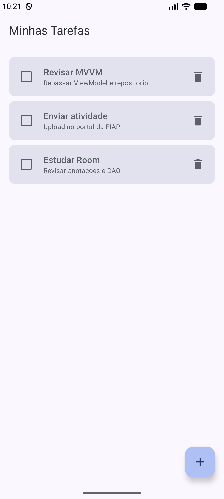
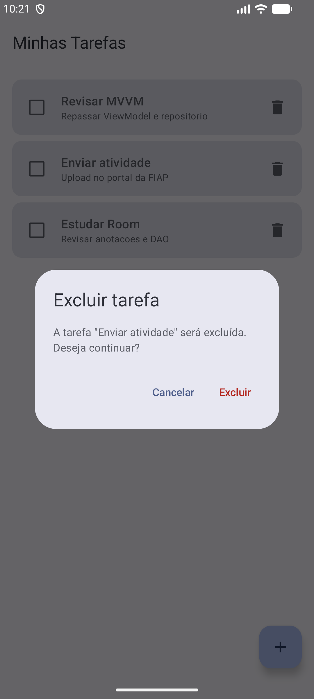
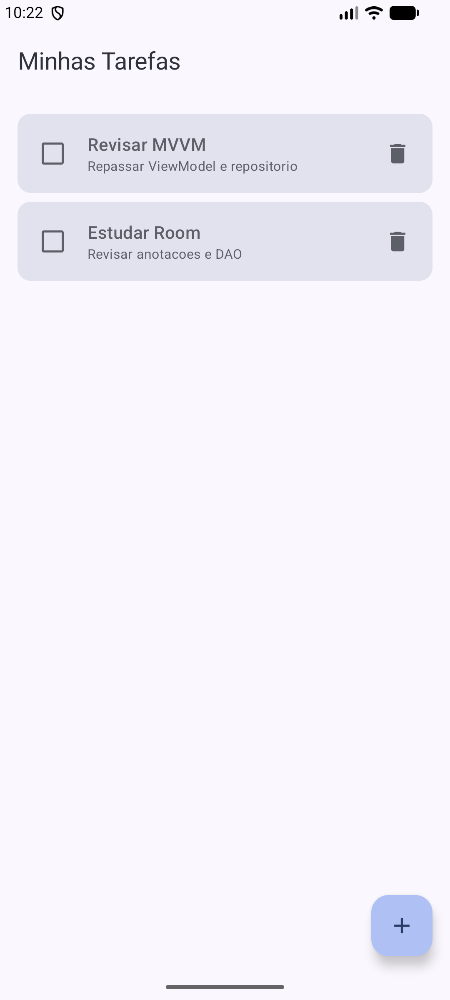

# Evidências da confirmação de exclusão

Capturas do emulador (Medium Phone, Android 16) demonstrando o fluxo de confirmação
antes da exclusão definitiva de uma tarefa.

## 1. Lista antes da exclusão

Três tarefas cadastradas: "Revisar MVVM", "Enviar atividade" e "Estudar Room".

## 2. Diálogo aberto com a tarefa selecionada

Ao tocar no ícone de lixeira da tarefa "Enviar atividade", o diálogo é exibido sobre a
lista, informando que a tarefa será excluída e apresentando o título dela.

## 3. Resultado ao cancelar

Após tocar em "Cancelar", o diálogo é fechado e a lista permanece com as três tarefas.

## 4. Nova abertura do diálogo

O diálogo é aberto novamente para a mesma tarefa "Enviar atividade".

## 5. Resultado após confirmar a exclusão

Após tocar em "Excluir", somente a tarefa selecionada é removida. "Revisar MVVM" e
"Estudar Room" continuam na lista.

