# ToDoList — Android (Kotlin + Jetpack Compose)

Aplicativo Android de lista de tarefas com persistência local. Permite **cadastrar**, **listar**, **editar**, **definir prazo**, **concluir** e **excluir** tarefas, com confirmação antes da exclusão.

Projeto acadêmico — Android Kotlin Developer / FIAP.

---

## Sumário

- [Funcionalidades](#funcionalidades)
- [Tecnologias](#tecnologias)
- [Como executar](#como-executar)
- [Telas do aplicativo](#telas-do-aplicativo)
- [Como funciona](#como-funciona)
- [Estrutura de pastas](#estrutura-de-pastas)
- [Previews do Compose](#previews-do-compose)
- [Testes](#testes)
- [Evidências da atividade](#evidências-da-atividade)

---

## Funcionalidades

| Funcionalidade | Descrição |
|---|---|
| Cadastrar tarefa | Título (obrigatório) e descrição (opcional) |
| Definir prazo | Data e horário opcionais, escolhidos em seletores do Material 3 |
| Listar tarefas | Ordenadas por prazo; tarefas sem prazo vão para o fim |
| Destacar atraso | Prazo vencido e tarefa não concluída aparece em vermelho e negrito |
| Editar tarefa | Toque no card abre o formulário já preenchido |
| Concluir tarefa | Checkbox aplica risco no título |
| Excluir tarefa | Diálogo de confirmação com **Cancelar** e **Excluir** |
| Persistência | Dados salvos no dispositivo com Room (SQLite) |

---

## Tecnologias

- **Kotlin** — linguagem do projeto.
- **Jetpack Compose (Material 3)** — interface declarativa.
- **Room** — persistência local em SQLite, com acesso via DAO.
- **Coroutines / Flow** — operações assíncronas e observação reativa (`Flow` → `StateFlow`).
- **ViewModel** — retenção de estado entre mudanças de configuração.
- **Navigation Compose** — navegação entre lista e formulário em um único `NavHost`.
- **KSP** — geração de código do Room.

---

## Como executar

### Pré-requisitos

| Item | Versão |
|---|---|
| Android Studio | Compatível com AGP 9.1.0 |
| JDK | 21 (o próprio Android Studio já traz em `jbr/`) |
| Android SDK | API 36 instalada |
| Dispositivo | Emulador ou aparelho físico com Android 7.0 (API 24) ou superior |

### Pelo Android Studio

1. Clone o repositório:
   ```bash
   git clone https://github.com/victoruizz/to-do-list-kotlin.git
   ```
2. No Android Studio, clique em **Open** e selecione a pasta raiz do projeto (a que contém `build.gradle.kts` e `settings.gradle.kts`).
3. Aguarde o **Gradle Sync** terminar. Na primeira vez o Gradle e as dependências são baixados.
4. Selecione um emulador no seletor de dispositivos ou conecte um aparelho com depuração USB ativada.
5. Clique em **Run ▶** (`Shift + F10`).

### Pela linha de comando

```bash
./gradlew assembleDebug                                   # gera o APK de debug
adb install -r app/build/outputs/apk/debug/app-debug.apk   # instala no dispositivo
```

O APK fica em `app/build/outputs/apk/debug/app-debug.apk`.

### Configuração do projeto

| Propriedade | Valor |
|---|---|
| `applicationId` | `victoruizz.com.github.todolist` |
| `minSdk` | 24 |
| `targetSdk` | 36 |
| `compileSdk` | 36 |
| Android Gradle Plugin | 9.1.0 |

---

## Telas do aplicativo

Capturas feitas no emulador (Medium Phone, Android 16).

### 1. Lista vazia

Estado inicial do app, sem nenhuma tarefa cadastrada. A mensagem "Nenhuma tarefa cadastrada." é exibida no centro e o botão flutuante **+** abre o formulário.

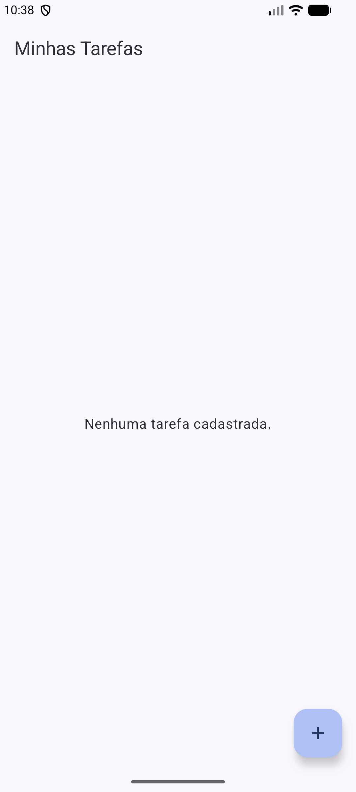

### 2. Formulário de nova tarefa

Aberto pelo botão **+**. O título da barra superior mostra "Nova Tarefa". O botão **Salvar** começa desabilitado, porque o título ainda está vazio.

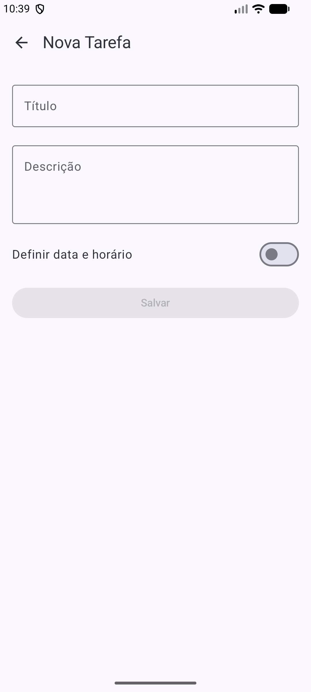

### 3. Formulário preenchido

Com o título preenchido, o botão **Salvar** é habilitado. A descrição é opcional. Nesse estado a tarefa seria salva sem prazo.

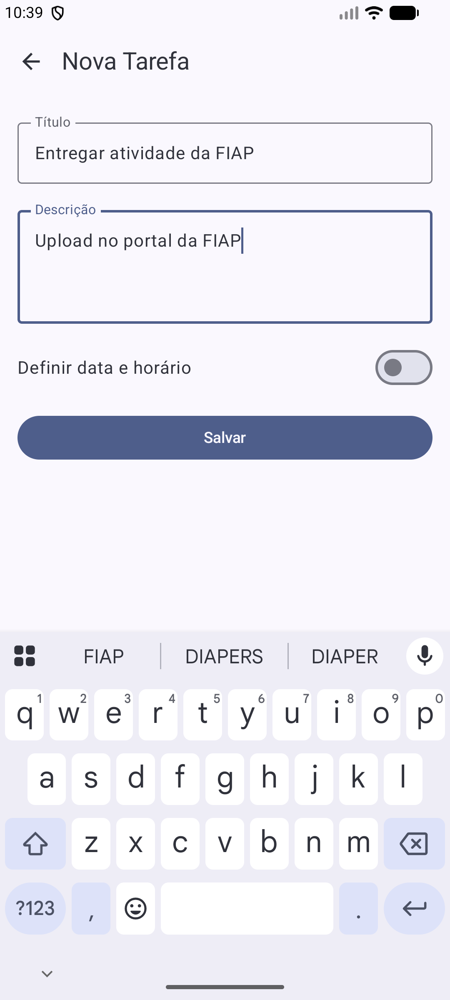

### 4. Data e horário ativados

Ao ligar o switch **Definir data e horário**, aparecem dois botões: um para a data e outro para a hora. Enquanto nenhum dos dois for escolhido, o **Salvar** fica desabilitado — o app não deixa salvar um prazo pela metade.

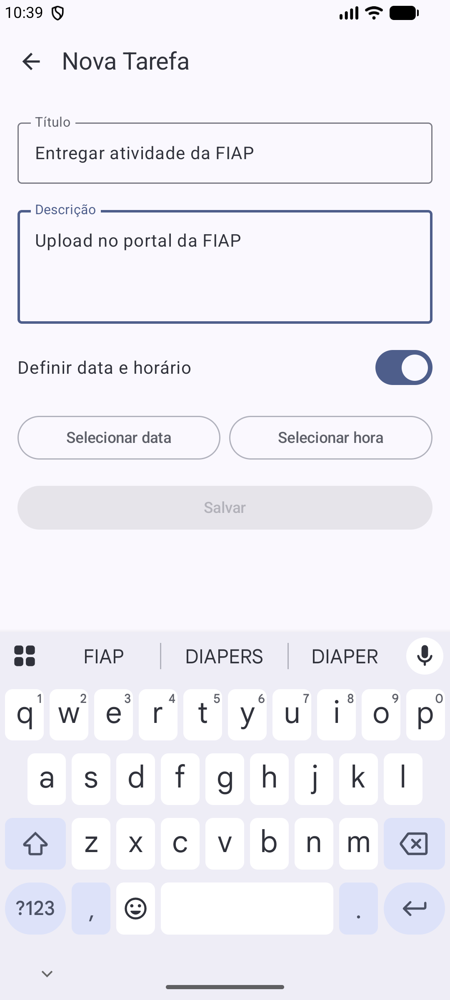

### 5. Seletor de data

`DatePickerDialog` do Material 3, aberto pelo botão **Selecionar data**. A data escolhida é convertida de UTC para o fuso do aparelho antes de ser guardada.

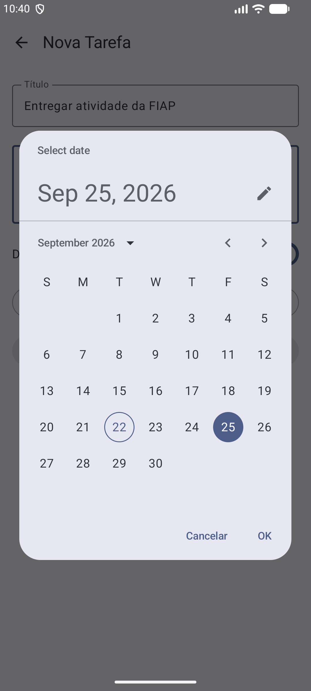

### 6. Seletor de hora

`TimePicker` do Material 3, em formato 24 horas, aberto pelo botão **Selecionar hora**. Os botões **Cancelar** e **OK** ficam abaixo do relógio.

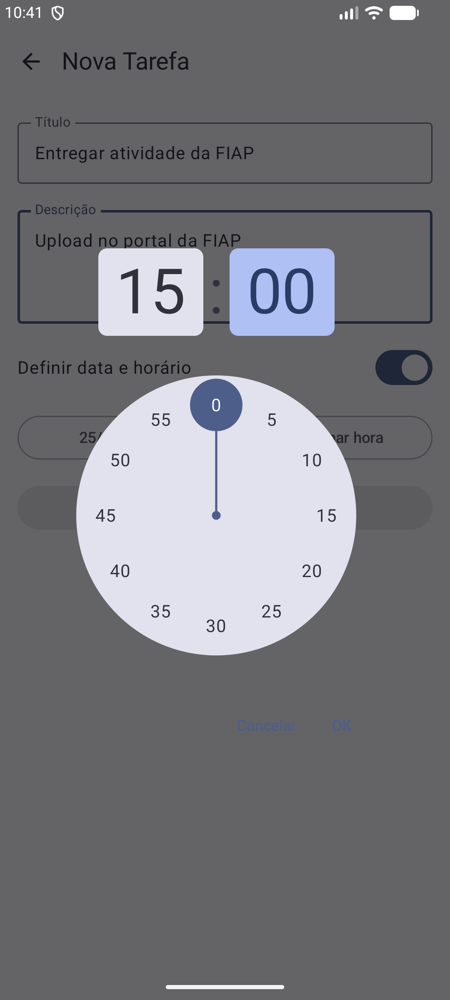

### 7. Formulário com prazo definido

Depois das escolhas, os botões passam a mostrar a data e a hora selecionadas (`25/09/2026` e `15:30`), e o **Salvar** é habilitado. Data e hora são combinadas em um único valor de milissegundos e gravadas no campo `dataHora`.

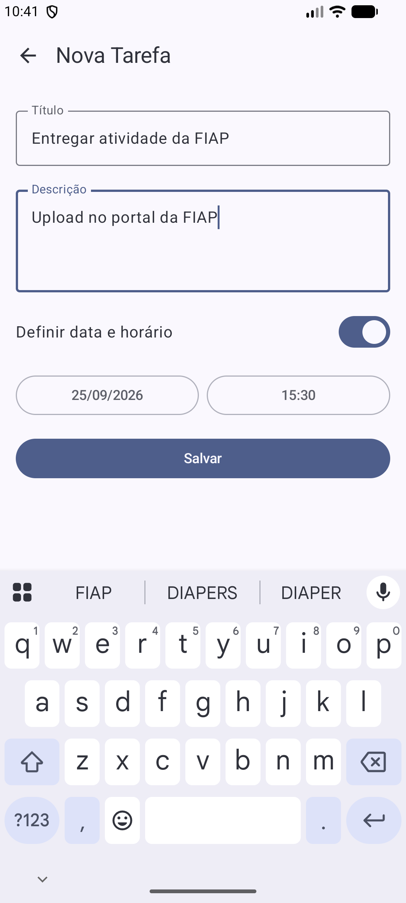

### 8. Tarefa cadastrada na lista

Ao salvar, o app volta para a lista. O card mostra título, descrição e o prazo formatado como `25/09/2026 às 15:30`.

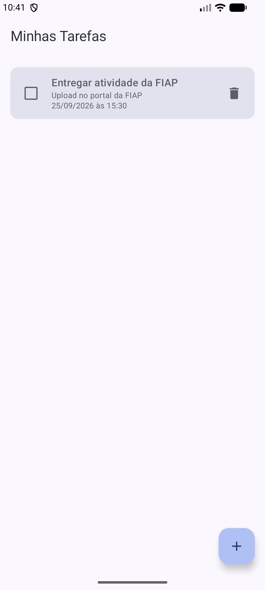

### 9. Ordenação por prazo e destaque de atraso

Com várias tarefas, a lista é ordenada pelo prazo mais próximo; tarefas sem prazo ficam por último. A tarefa "Revisar MVVM", cujo prazo já passou e que não está concluída, aparece em **vermelho e negrito**.

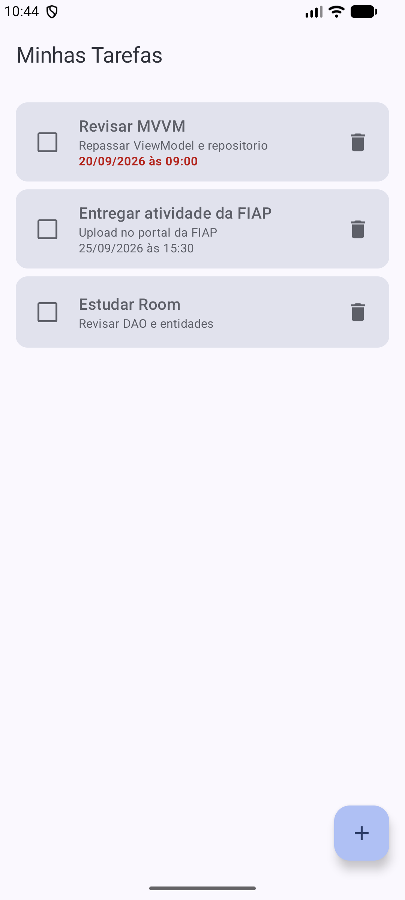

### 10. Edição de tarefa

Tocar no card abre o mesmo formulário em modo de edição: a barra superior mostra "Editar Tarefa" e todos os campos vêm preenchidos, inclusive o prazo. Ao salvar, o registro existente é atualizado em vez de criar um novo.

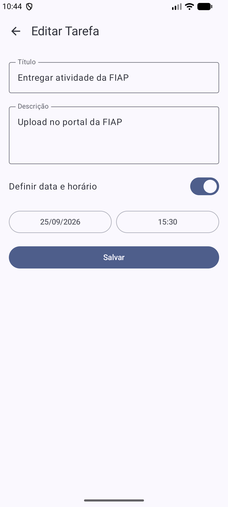

### 11. Tarefa concluída

Marcar o checkbox risca o título da tarefa. A tarefa concluída deixa de ser tratada como atrasada, mesmo que o prazo já tenha vencido.

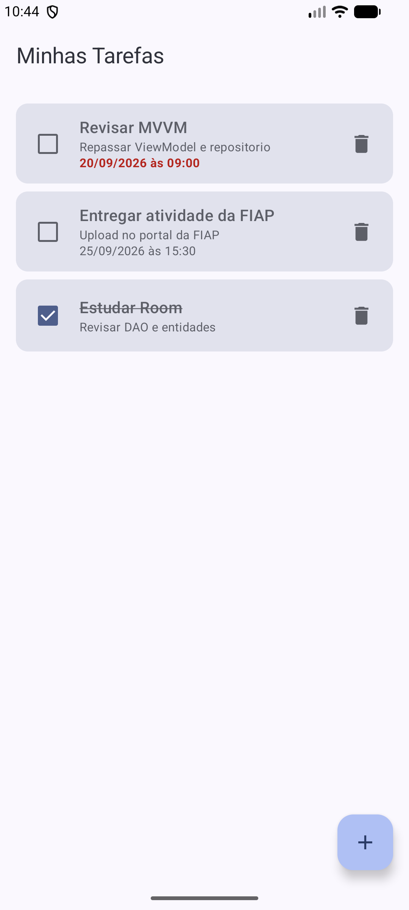

### 12. Confirmação de exclusão

O ícone de lixeira não exclui direto: abre um diálogo sobre a lista, informando o título da tarefa selecionada. **Cancelar** fecha sem alterar nada e **Excluir** remove apenas aquela tarefa.

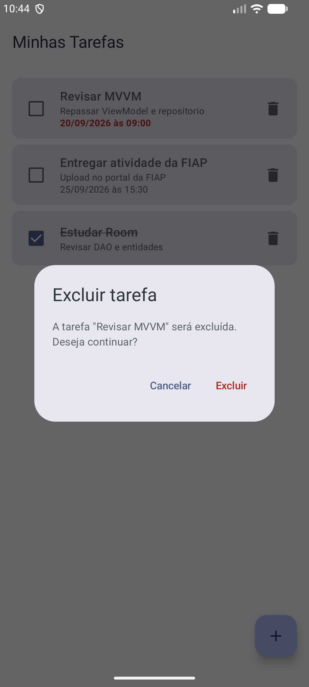

O passo a passo completo desse fluxo está em [EVIDENCIAS_EXCLUSAO.md](EVIDENCIAS_EXCLUSAO.md).

---

## Como funciona

### Arquitetura

O projeto segue MVVM, em camadas, com a UI reagindo automaticamente às mudanças dos dados.

```
MainActivity
     |
     v
AppNavigation (NavHost)
     |
     |-- ListaTarefasScreen
     |-- FormularioTarefaScreen
     |
     v
TarefaViewModel
     |
     v
TarefaRepository
     |
     v
TarefaDao -- TarefaDatabase (Room)
```

### Fluxo dos dados

1. O `TarefaDao` expõe as tarefas como um `Flow`, que o Room atualiza sozinho a cada mudança no banco.
2. O `TarefaRepository` repassa esse `Flow`, isolando o resto do app dos detalhes do Room.
3. O `TarefaViewModel` converte o `Flow` em `StateFlow` com `stateIn`.
4. A tela coleta esse estado com `collectAsStateWithLifecycle()` e se recompõe a cada emissão.

Ou seja: inserir, atualizar ou excluir uma tarefa não exige recarregar a tela. A gravação no banco dispara uma nova emissão e a lista se atualiza sozinha.

### Componentes

#### TarefaRepository

Intermedia o acesso aos dados.

- `tarefas: Flow<List<Tarefa>>` — fluxo vindo de `TarefaDao.listarTodas()`.
- `inserir()`, `atualizar()`, `deletar()` — funções `suspend` que delegam ao DAO.

**Responsabilidade única:** abstrair a fonte de dados. Se a origem mudasse (por exemplo, para uma API remota), só o Repository precisaria mudar — ViewModel e UI continuariam iguais.

#### TarefaViewModel

Guarda e gerencia o estado da UI.

- Converte o `Flow` do repositório em `StateFlow` usando `SharingStarted.WhileSubscribed(5_000)` — o fluxo segue ativo por 5 segundos após a UI parar de observar, evitando reprocessamento em trocas rápidas de tela.
- Expõe `inserir`, `atualizar` e `deletar`, cada uma disparando uma coroutine em `viewModelScope` (cancelada automaticamente se o ViewModel for destruído).
- Fornece uma `factory` que monta o `TarefaRepository` a partir do `TarefaDao`. Não há framework de injeção de dependência; a criação é manual via `ViewModelProvider.Factory`.

#### ListaTarefasScreen

- Renderiza a lista em uma `LazyColumn`, cada item como um `Card` com checkbox, título, descrição, prazo e botão de excluir.
- As ações não alteram estado direto na tela — chamam o ViewModel:

  | Ação do usuário | Resultado |
  |---|---|
  | Marcar/desmarcar o checkbox | `viewModel.atualizar(...)` |
  | Ícone de lixeira | Abre o diálogo de confirmação |
  | Botão **Excluir** do diálogo | `viewModel.deletar(...)` |
  | Botão **Cancelar** do diálogo | Fecha o diálogo, sem alterar a lista |
  | Clique no card ou no **+** | Navega para o formulário |

- A tarefa escolhida para exclusão fica em um estado local (`Tarefa?`): `null` significa diálogo fechado, e um valor significa diálogo aberto para aquela tarefa — por isso só a tarefa selecionada é excluída.
- Toda a UI está isolada em `ListaTarefasContent`, um Composable sem dependência do ViewModel, o que permite reaproveitá-lo nas `@Preview`.

#### FormularioTarefaScreen — cadastro e edição

| Condição | Comportamento |
|---|---|
| `tarefaId == 0` | Nova tarefa — formulário abre vazio (`isEdicao = false`) |
| `tarefaId != 0` | Edição — busca a tarefa na lista observada e preenche os campos (`isEdicao = true`) |

- Ao salvar, o mesmo ID decide a ação: `viewModel.inserir(...)` ou `viewModel.atualizar(...)`, preservando o `id` original nas edições.
- Depois de salvar, a navegação volta para a lista.
- O título da barra superior muda entre "Nova Tarefa" e "Editar Tarefa".
- O prazo é opcional: com o switch desligado, `dataHora` é gravado como `null`.

#### AppNavigation — rotas

| Rota | Tela | Observação |
|---|---|---|
| `lista` | `ListaTarefasScreen` | Tela inicial (`startDestination`) |
| `formulario/{tarefaId}` | `FormularioTarefaScreen` | Recebe o ID da tarefa como argumento |

- Nova tarefa → `navigate("formulario/0")` — o ID `0` sinaliza criação.
- Editar → `navigate("formulario/$id")` — passa o ID real.
- O botão de voltar chama `popBackStack()`, sem empilhar uma nova instância da lista.

#### MainActivity

1. No `onCreate`, chama `setContent { }` envolvendo a UI no `TodolistTheme`.
2. Obtém a `TarefaViewModel` via `viewModel(factory = TarefaViewModel.factory(applicationContext))`, que monta o `TarefaDatabase`, extrai o `TarefaDao` e injeta no `TarefaRepository`.
3. Passa essa mesma instância para `AppNavigation` — assim lista e formulário compartilham o mesmo ViewModel, e o formulário consegue localizar a tarefa em edição.

#### DataHoraUtil

Funções de apoio para o prazo:

- `combinarDataHora(...)` — junta data e hora em milissegundos.
- `formatarDataHora(...)` — formata para exibição (`dd/MM/yyyy às HH:mm`).
- `paraMillisUtcDoDatePicker(...)` e `extrairDataDoDatePicker(...)` — convertem entre o fuso local e o UTC usado pelo `DatePicker`.

---

## Estrutura de pastas

```
app/src/main/java/victoruizz/com/github/todolist/
├── MainActivity.kt
├── data/
│   ├── Tarefa.kt              # @Entity do Room
│   ├── TarefaDao.kt           # consultas
│   └── TarefaDatabase.kt      # banco (singleton)
├── navigation/
│   └── AppNavigation.kt       # NavHost e rotas
├── repository/
│   └── TarefaRepository.kt
├── ui/theme/
│   ├── ListaTarefasScreen.kt  # lista + diálogo de exclusão
│   ├── FormularioTarefaScreen.kt
│   ├── Color.kt / Theme.kt / Type.kt
├── util/
│   └── DataHoraUtil.kt
└── viewmodel/
    └── TarefaViewModel.kt
```

---

## Previews do Compose

As telas têm `@Preview` que rodam sem banco e sem ViewModel, direto no painel **Split / Design** do Android Studio:

| Preview | Mostra |
|---|---|
| Lista com tarefas | Lista preenchida |
| Lista vazia | Estado sem tarefas |
| Confirmação de exclusão | Lista com o diálogo aberto |
| Diálogo de exclusão | Somente o diálogo |
| Item pendente / concluído | Card nos dois estados |
| Item com prazo futuro / atrasado | Prazo normal e prazo em destaque |
| Nova tarefa | Formulário vazio |
| Editar tarefa avulsa | Formulário preenchido, sem prazo |
| Editar tarefa com data/hora | Formulário preenchido, com prazo |

---

## Testes

Testes instrumentados (rodam em emulador ou aparelho):

```bash
./gradlew connectedDebugAndroidTest
```

| Teste | Verifica |
|---|---|
| `TarefaDaoTest` | Inserção, atualização, exclusão e listagem no Room |
| `DataHoraUtilTest` | Conversão e formatação de data e hora |

---

## Evidências da atividade

O arquivo [EVIDENCIAS_EXCLUSAO.md](EVIDENCIAS_EXCLUSAO.md) traz, em sequência, as capturas exigidas pela atividade de confirmação de exclusão: lista antes, diálogo aberto, resultado ao cancelar, nova abertura do diálogo e resultado após confirmar.
